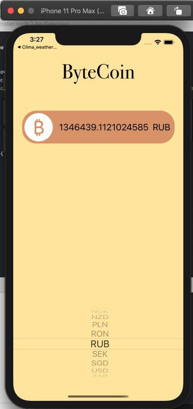

# ByteCoin

This app gives you current price of bitcoin

In this app i used https://www.coinapi.io to get data for decoding.

## Next technologies were implemented: ##

1) URLSession to make a network request

2) JSONDecoder to parse json file and get the data in right format

3) Delegate pattern to handling possible errors and updating UI

4) UIPickerView + UILabel in storyboard to shows you the result

## How it works: ##

You choose the fiat currency you needed by using UIPickerView and get current rate inside of a label:

